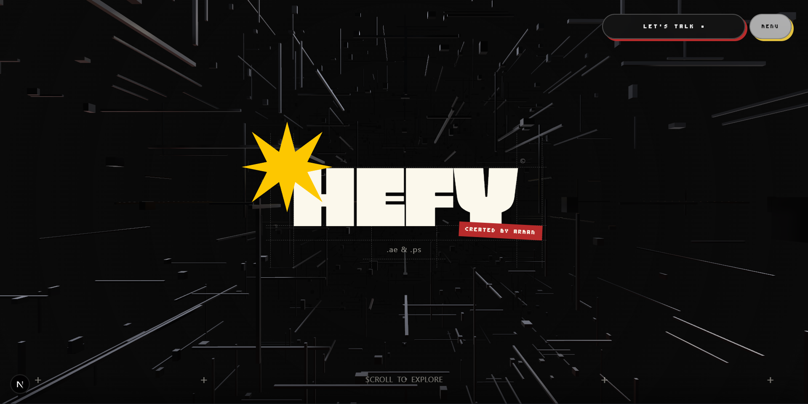

# Arman Singh - Motion & Design Portfolio

A scroll-driven portfolio site for a motion graphics & poster designer, built with Next.js, Framer Motion, and Three.js.




**[→ View the live site](https://design.armansingh.me)**

## Quick start

```bash
git clone <this-repo-url>
cd <this-repo-folder>
npm install
npm run dev
```

Then open [http://localhost:3000](http://localhost:3000).

## Features

1. **3D animated hero**: an infinite tunnel of glass-like instanced boxes rendered with `@react-three/fiber`, with bloom post-processing and a subtle camera-follows-cursor effect
2. **Scroll-synced snake illustration**: an SVG path that draws itself as you scroll through the About section, then hands off to a spring-based autoplay animation at the scroll boundary
3. **Smooth, inertial scrolling** site-wide via Lenis, plus a custom drag-to-scroll scrollbar
4. **Category-based project showcase**: posters, custom typography, motion graphics, hand-drawn 2D game assets, and college society promo work, each with its own interaction (hover-for-sound video previews, a live custom-font typing demo, click-to-swap timelapse videos)
5. **Contact form** that fires off both a Discord webhook notification and a transactional email via Resend, with inline bento-grid style validation
6. **Custom animated floating nav** with a staggered dropdown menu and a playful zipper-style section divider

## Running locally

Requirements:
- Node.js 18+
- npm (or your package manager of choice — no lockfile-specific tooling is assumed)

Environment variables (create a `.env.local`):

```
RESEND_API_KEY=your_resend_api_key
DISCORD_WEBHOOK_URL=your_discord_webhook_url
CONTACT_EMAIL_FROM=you@yourdomain.com
CONTACT_EMAIL_TO=you@yourdomain.com
```

These power `/api/contact`, which the Contact section posts to. Without them the rest of the site still runs fine — only the contact form submission will fail.

```bash
npm run dev      # start the dev server
npm run build    # production build
npm run lint     # eslint
```

## How it works

The hero's tunnel effect is a single `InstancedMesh` of 1,500 boxes rather than 1,500 separate meshes, each box's position, scale, and z-depth loop through a fixed depth range every frame, which keeps the scene at 60fps without leaning on the GPU for draw calls it doesn't need.

The About section's snake illustration is the more fiddly piece: it's driven by scroll for the first ~55% of the section, then "hands off" to a timed spring animation once the person scrolls past that point, with debounced logic to smoothly bridge back to scroll-driven control if they reverse direction mid-animation. The goal was to make the snake feel alive on fast scrolls without janking on slow, deliberate ones.

Styling leans on Tailwind v4 (via `@tailwindcss/postcss`) with a small set of hand-rolled utility classes in `globals.css` for the grain/grid backgrounds and marquee keyframes, since those effects don't map cleanly to utility classes.

## Stack

- [Next.js](https://nextjs.org/) (App Router) + TypeScript
- [Tailwind CSS v4](https://tailwindcss.com/)
- [Framer Motion](https://www.framer.com/motion/) for UI animation
- [React Three Fiber](https://docs.pmnd.rs/react-three-fiber) + [drei](https://github.com/pmndrs/drei) + `@react-three/postprocessing` for the 3D hero
- [Lenis](https://github.com/darkroomengineering/lenis) for smooth scrolling
- [Resend](https://resend.com/) for transactional email

## Credits

- Custom display typeface (`Boxy-Regular.otf`) designed from scratch
- Pixel art game assets hand-drawn by the site's designer
- Motion clips and posters produced for the GeeksforGeeks MITS chapter media team